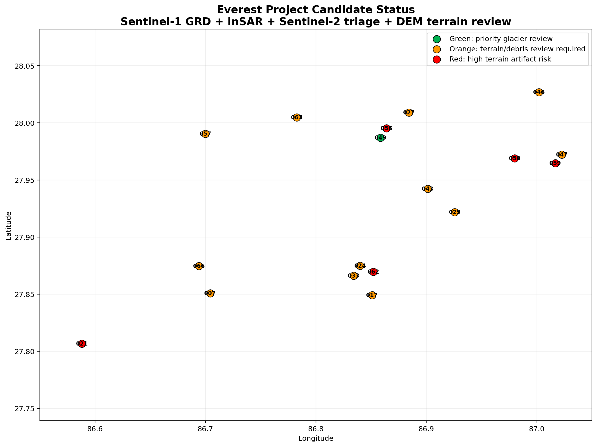
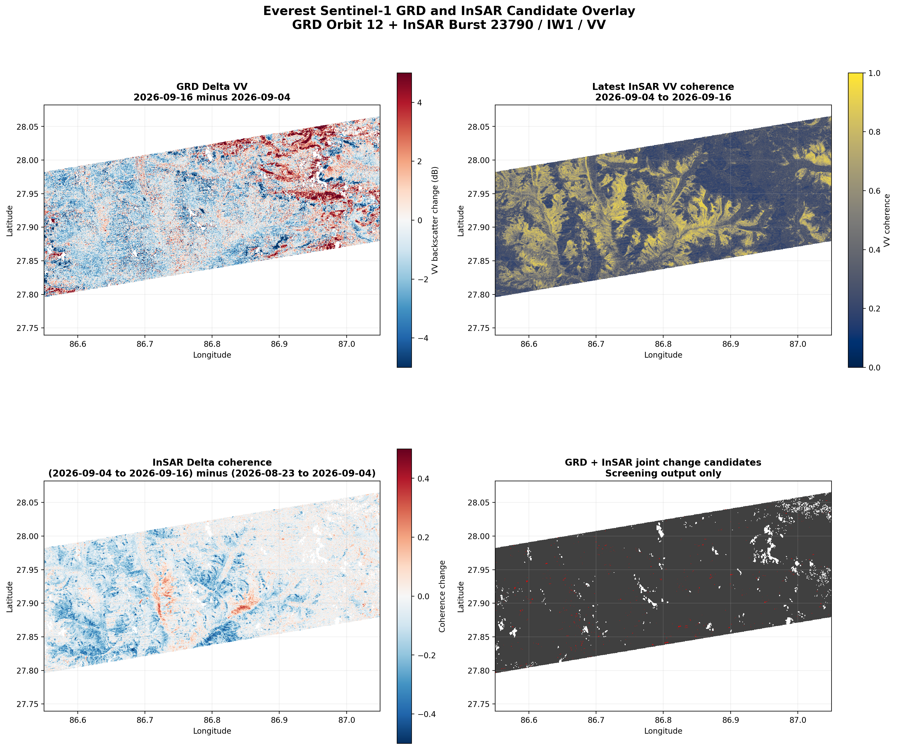
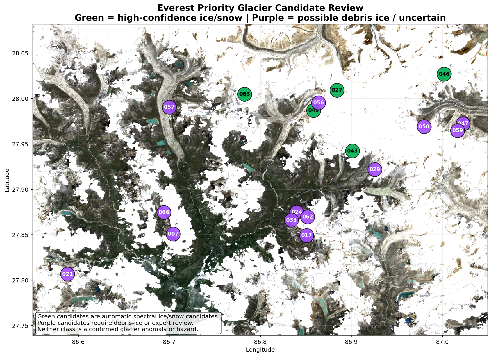
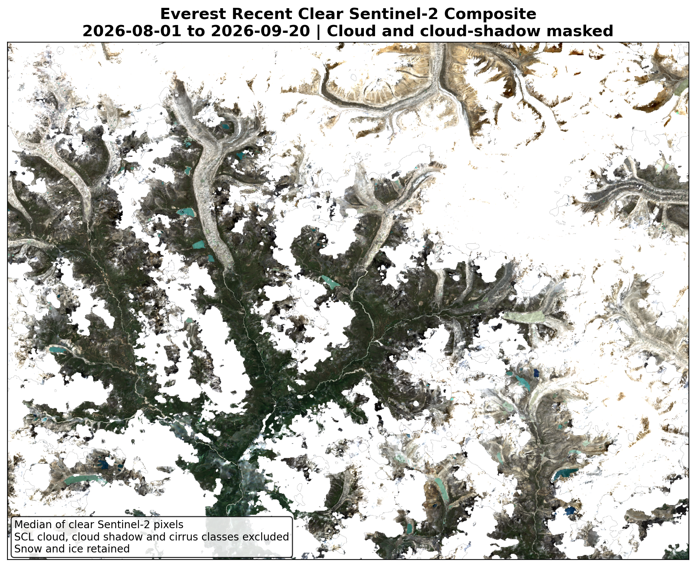

# HQMW Cryosphere - Windy Plugin

[English](#english) | [中文说明](#chinese)

---

## English Overview

**HQMW Cryosphere** is a specialized, private/community Windy.com map plugin designed for high-mountain natural environment observation and glacier anomaly screening in the Mount Everest region. It integrates **NASA EOSDIS GIBS** satellite layers with automated multi-temporal SAR (Sentinel-1 GRD / InSAR coherence) and optical (Sentinel-2) screening pipelines from **Copernicus Data Space Ecosystem (CDSE)**.

### Generated Pipeline Visualizations (Latest CDSE Analysis)

Below are the latest verified pipeline figures generated from the Everest glacier screening workflow (Period: 2026-09-04 to 2026-09-16):

#### 1. Everest Project Candidate Status Map
> Comprehensive screening of candidate anomalies across the Everest AOI, categorizing priority glacier review points and steep terrain review regions.

#### 2. Joint GRD + InSAR Candidate Overlay
> Sentinel-1 multi-temporal backscatter changes coupled with InSAR coherence drop indicators.

#### 3. Priority Glacier Candidate Review Map
> Optical triage (Sentinel-2 clear composite) validating clean ice/snow versus rock/moraine spectral signatures.

#### 4. Sentinel-2 Cloud-Free Base Composite (2026-08-01 ~ 2026-09-20)
> Cloud-optimized, high-resolution optical surface reference aligned to candidate footprints.

### Key Features
- **NASA EOSDIS GIBS WMTS Integration**: Real-time tile rendering for cryosphere, snow cover (MODIS/VIIRS), soil moisture, and atmospheric layers.
- **Embedded Glacier Candidate Layer**: Displays high-confidence glacier anomaly candidates (`EVEREST-S1-CAND-049`, etc.) directly on the Windy map with slope, area, and triage metadata.
- **Local Fallback**: Automatically loads built-in verified candidate features if local backend proxy is offline.
- **Everest Focus**: One-click camera viewport targeting the Everest massif.

### Safety & Interpretation Boundary
This plugin is an imagery viewer and experimental screening interface. It does **not** confirm disasters, issue CAP messages, trigger evacuations, or declare route closures. All candidates require verified multi-source confirmation.

---

## 中文说明

**HQMW Cryosphere（珠峰冰冻圈环境监测系统）** 是为 [Windy.com](https://www.windy.com) 定制开发的高山冰冻圈卫星遥感与冰川异常检测插件。本插件将 **NASA EOSDIS GIBS** 遥感底图与来自 **欧空局 Copernicus Data Space (CDSE)** 的 Sentinel-1 合成孔径雷达（GRD/InSAR 相干性）及 Sentinel-2 多光谱自动化初筛管线成果完整融合。

### 最新处理流程与生成图像（2026-09-04 至 2026-09-16）

#### 1. 珠峰候选异常状态分布图 (Candidate Status Map)
> 全面展示珠峰区域通过雷达后向散射与相干性变动筛选出的 18 个评估候选点，并依据地形坡度与光谱特征进行分级管控（优先级冰川审查 vs 高坡度人工假象风险）。

#### 2. Sentinel-1 GRD 强度与 InSAR 相干性联合叠加图
> 结合了 Sentinel-1 升降轨后向散射差值与 InSAR 干涉失相干区域的多时相联合变化掩模。

#### 3. 优先级冰川审查候选点分布图 (Priority Review Map)
> 结合哨兵2号多光谱（SCL分类与积雪/裸岩占比）对候选点进行的精细分流核验。

#### 4. 珠峰区域 Sentinel-2 无云清晰合成底图 (2026-08-01 ~ 2026-09-20)
> 覆盖核心观测区的高清真彩色光学背景参考影像，与雷达异常检测候选网格完全对齐。

### 核心功能
1. **NASA GIBS 全球遥感底图**：在 Windy LeafletGL 底图上直接检索并渲染冰冻圈（积雪覆盖率、冻融、冰面温度）、水圈、Sentinel-2 高清影像。
2. **最新冰川变化候选图层**：内置 2026-09-04 ~ 2026-09-16 最新的雷达初筛候选点（如重点冰川变动候选点 `EVEREST-S1-CAND-049`），支持红/黄警戒分级显示并弹出面积、坡度与审查状态。
3. **无缝离线降级**：即便本地 CDSE/Python 代理未运行，插件也能直接展示内嵌的经过验证的最新候选成果。
4. **一键珠峰视角**：快速定位并对焦珠穆朗玛峰大本营及主峰区域。

### 安全与业务边界
本插件仅作为遥感影像观测与实验性初筛的可视化工具。任何检测到的候选点并不等同于已发生的冰崩、雪崩或灾害事件，不得直接用于触发 CAP 应急报文发布、路线关闭或人员疏散。